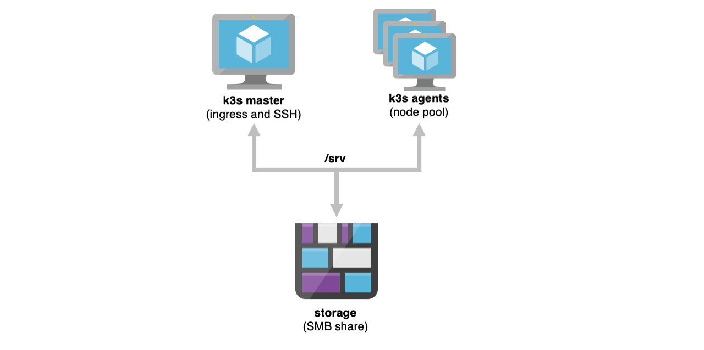

# azure-k3s-cluster (WIP)

A (WIP) dynamically resizable [`k3s`][k3s] cluster for Azure, based on my [`azure-docker-swarm-cluster`][adsc] project.

## What

This is an Azure Resource Manager template that automatically deploys a [`k3s`][k3s] cluster atop Ubuntu 20.04. This cluster has a single master VM and a VM scaleset for workers/agents, plus required network infrastructure.

The template defaults to deploying B-Series VMs (`B1ls`) with the smallest possible managed disk size (S4, 32GB). It also deploys (and mounts) an Azure File Share on all machines with (very) permissive access at `/srv`, which makes it quite easy to run stateful services without messing about with volume claims.

The key aspect of this template is that _you can add and remove agents at will_ simply by resizing the VM scaleset, which is very handy when running the node pool as spot instances - the cluster comes with a few (very simple) helper scripts that allow nodes to join and leave the cluster as they are created/destroyed, and the `k3s` scheduler will redeploy pods as needed.

## Why

This was originally built as [a Docker Swarm template][adsc], and even though Azure has a perfectly serviceable Kubernetes managed service, I enjoy the challenge of building my own stuff and fine-tuning it.

[`k3s`][k3s] is a breath of fresh air, and an opportunity to play around with a simpler, slimmer version of Kubernetes--and break it to see what happens.

Also, a lot of the ARM templating involved (for metrics, managed identities, etc.) lacked comprehensive samples when I started the project, so this was also a way for me to provide a fully working example that other people can learn from.

## Roadmap

* [ ] air-gapped (i.e., standalone) install without `curl`
* [ ] test metrics server
* [ ] document `cloud-config`
* [ ] clean `kubernetes-dashboard` deployment
* [ ] WIP: sample deployments/pods/charts
* [ ] *TODO*: Leverage [Instance Protection](https://docs.microsoft.com/en-us/azure/virtual-machine-scale-sets/virtual-machine-scale-sets-instance-protection) and [Scale-In Policies](https://docs.microsoft.com/en-us/azure/virtual-machine-scale-sets/virtual-machine-scale-sets-scale-in-policy)
* [ ] WIP: simple Python scale-down helper ([blog post](https://taoofmac.com/space/blog/2019/06/15/1740) on how I'm going to do that with managed service identities and the instance metadata service)
* [ ] support an easy way to automatically redeploy charts and manifests when the compute resource group is recreated (`/srv/autostart`?)
* [x] add pre-defined NSGs for Cloudflare ingress and origin SSH access (*TODO*: Separate handling for IPv6)
* [x] support an (insecure) private registry hosted on the master node (requires using `docker` instead of `containerd`, but saves a lot of hassle when doing tests)
* [x] allow setting SSH_PORT via `Makefile`
* [x] upgrade to `k3s` v1.22.3+k3s1
* [x] temporarily remove Docker support so that I can explore `k3c`
* [x] temporarily remove advanced Azure Linux diagnostics extensions (3.0) due to incompatibility with Ubuntu 20.04 (extension looks for `python` instead of `python3`)
* [x] update Azure templates, helper scripts and `cloud-config` for Ubuntu 20.04 and `python3`
* [x] upgrade to `k3s` v1.19.4+k3s1
* [x] Handle eviction notifications
* [x] Use Spot Instances for node pool
* [x] upgrade to `k3s` v1.17.0+k3s.1
* [x] upgrade to `k3s` 1.0.1
* [x] upgrade to `k3s` 1.0.0
* [x] upgrade to `k3s` 0.8.0
* [x] upgrade to `k3s` 0.7.0
* [x] upgrade to `k3s` 0.6.0
* [x] re-usable user-assigned service identity instead of system (per-machine)
* [x] Managed Service Identity for master and role allocations to allow it to manage the scaleset (and the rest of the resource group)
* [x] add Linux Monitoring Extension (3.x) to master and agents (visible in the "Guest (classic)" metrics namespace in Azure Portal)
* [x] scratch folder on agents' temporary storage volume (on-hypervisor SSD), available as `/mnt/scratch`
* [x] set timezone
* [x] `bash` completion for `kubectl` in master node
* [x] remove scale set load balancer (everything must go through `traefik` on the master)
* [x] re-enable first-time reboot after OS package updates
* [x] private registry on master node
* [x] trivial ingress through master node (built-in)
* [x] Set node role labels
* [x] install `k3s` via`cloud-config`
* [x] change `cloud-config` to expose `k3s` token to agents
* [x] remove unused packages from `cloud-config`
* [x] remove unnecessary commands from `Makefile`
* [x] remove unnecessary files from repo and trim history
* [x] fork, new `README`

## `Makefile` commands

* `make keys` - generates an SSH key for provisioning
* `make deploy-storage` - deploys shared storage
* `make params` - generates ARM template parameters
* `make deploy-compute` - deploys cluster resources and pre-provisions Docker on all machines
* `make view-deployment` - view deployment status
* `make watch-deployment` - watch deployment progress
* `make list-agents` - lists all agent VMs
* `make scale-agents-<number>` - scales the agent VM scale set to `<number>` instances, i.e., `make scale-10` will resize it (up or down) to 10 VMs
* `make stop-agents` - stops all agents
* `make start-agents` - starts all agents
* `make reimage-agents-parallel` - nukes and paves all agents
* `make reimage-agents-serial` - reimages all agents in sequence
* `make chaos-monkey` - restarts all agents in random order
* `make proxy` - opens an SSH session to `master0` and sets up TCP forwarding to `localhost`
* `make tail-helper` - opens an SSH session to `master0` and tails the `k3s-helper` log
* `make list-endpoints` - list DNS aliases
* `make destroy-cluster` - destroys the entire cluster

## Recommended Sequence

    az login
    make keys
    make deploy-storage
    make params
    make deploy-compute
    make view-deployment
    # Go to the Azure portal and check the deployment progress
    
    # Clean up after we're done working
    make destroy-cluster

## Requirements

* [Python 3][p]
* The [Azure CLI][az] (`pip install -U -r requirements.txt` will install it)
* GNU `make` (you can just read through the `Makefile` and type the commands yourself)

## Internals

`master0` runs a very simple HTTP server (only accessible inside the cluster) that provides tokens for new VMs to join the cluster and an endpoint for them to signal that they're leaving. That server also cleans up the node table once agents are gone.

Upon provisioning, all agents try to obtain a token and join the cluster. Upon rebooting, they signal they're leaving the cluster and re-join it again.

This is done in the simplest possible way, by using `cloud-init` to bootstrap a few helper scripts that are invoked upon shutdown and (re)boot. Check the YAML files for details.

## Provisioning Notes

The cluster is actually split across two resource groups (`-storage` and `-compute`). 

The `-storage` resource group contains an Azure Storage Account with an Azure Files (SMB) share that is mounted on all the nodes. This makes it trivial to deploy the cluster, work on it for a few hours, store your manifests and data on `/srv`, destroy the `-compute` resources to save costs and spin them up again against the same `-storage` the next day.

## Deployment Notes

To avoid using VM extensions (which are nice, but opaque to most people used to using `cloud-init`) and to ensure each fresh deployment runs the latest Docker version, VMs are provisioned using `customData` in their respective ARM templates.

`cloud-init` files and SSH keys are then packed into the JSON parameters file and submitted as a single provisioning transaction, and upon first boot of a node (master or agent) Ubuntu takes the `cloud-init` file and provisions the machine accordingly.

See [`azure-docker-swarm-cluster`][adsc] for more details.

## Private Registry

Deploying `registry/registry.yml` will set up a container registry on the master node that uses the shared Azure Files storage (mounted in `/srv`) as backing store.

The container registry is "insecure" in that it does not require authentication nor uses HTTPS, but it is accessible only to the cluster nodes and does not require setting up any kind of certificates.

This makes it _very_ easy to use `docker` on the master node to manage images, and having the registry mapped to the SMB share ensures it is persistent across cluster deployments if you don't delete the `-storage` resource group.

> **Pro Tip:** You can set `STORAGE_ACCOUNT_GROUP` and `STORAGE_ACCOUNT_NAME` inside an `.env` file if you want to use a pre-existing storage account. As long as you use `make` to do everything, the value will be automatically overridden.

## Disclaimers

Keep in mind that this was written for conciseness and ease of experimentation -- look to AKS for a production service.

[k3s]: https://k3s.io
[adsc]: https://github.com/rcarmo/azure-docker-swarm-cluster
[d]: http://docker.com
[p]: http://python.org
[dh]: https://hub.docker.com/r/rcarmo/demo-frontend-stateless/
[az]: https://github.com/Azure/azure-cli
